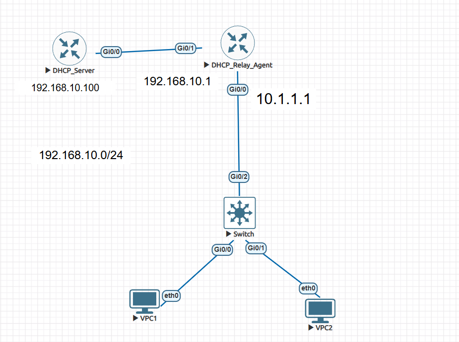
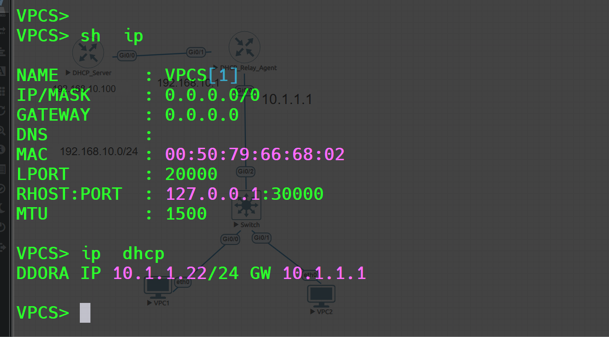

# DHCP Relay Agent Lab

This lab demonstrates how to configure a DHCP relay agent on a Cisco router so clients in a different subnet can receive IP addresses from a centralized DHCP server.

## Topology



## Lab Overview

In this setup, the DHCP server router is in the `192.168.10.0/24` network, while the client network is `10.1.1.0/24`. Because DHCP broadcast messages do not cross routers by default, the relay router uses the `ip helper-address` command to forward DHCP requests to the DHCP server.

## IP Addressing

| Device/Role | Interface | IP Address | Purpose |
|---|---:|---:|---|
| DHCP Server Router | G0/0 | `192.168.10.100/24` | Provides DHCP service |
| DHCP Relay Router | G0/0 | `10.1.1.1/24` | Client-side default gateway |
| DHCP Relay Router | G0/1 | `192.168.10.1/24` | Server-side connection |
| DHCP Clients | NIC | DHCP | Receives address from DHCP pool |

## DHCP Server Configuration

```cisco
interface g0/0
 ip address 192.168.10.100 255.255.255.0
 no shutdown
exit

ip dhcp excluded-address 10.1.1.1 10.1.1.20

ip dhcp pool Client_Pool
 network 10.1.1.0 255.255.255.0
 default-router 10.1.1.1
 dns-server 8.8.8.8
exit

ip route 10.1.1.0 255.255.255.0 192.168.10.1
```

## DHCP Relay Router Configuration

### Client-Side Interface

```cisco
interface g0/0
 ip address 10.1.1.1 255.255.255.0
 no shutdown
exit
```

### Server-Side Interface

```cisco
interface g0/1
 ip address 192.168.10.1 255.255.255.0
 no shutdown
exit
```

### Helper Address

Apply the helper address on the interface that receives DHCP broadcasts from clients.

```cisco
interface g0/0
 ip helper-address 192.168.10.100
exit
```

## Verification



Use the following commands to verify the DHCP relay configuration:

```cisco
show ip interface brief
show running-config | section dhcp
show ip dhcp binding
show ip dhcp pool
show ip route
```

On the client PC, confirm that it receives:

- An IP address from the `10.1.1.0/24` network
- Default gateway `10.1.1.1`
- DNS server `8.8.8.8`

## Key Concept

The `ip helper-address` command converts client DHCP broadcasts into unicast packets and forwards them to the DHCP server. This allows a DHCP server in one network to assign IP addresses to clients in another network.

